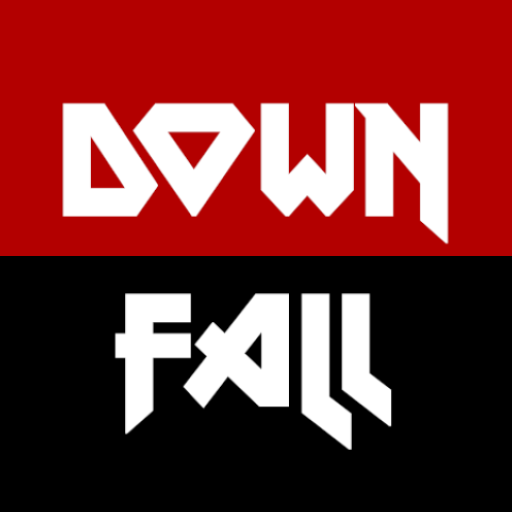

# The Downfall 

_The Downfall_ is an arcade game for Android using [Box2D physics](https://box2d.org/).

    

The doomsday has arrived for all of us. But you don't let yourself down that easily. Take the challenge of survival and beat the highscore by getting as deep as possible.

You can download the game from [Google Play Store](https://play.google.com/store/apps/details?id=de.bsautermeister.bomb), or watch the [Downfall video](https://www.youtube.com/watch?v=gNE867YwZ84) on YouTube.

### Features
- Fully destructible physical 2D world
- Online leaderboards and achievements
- View top players score in your game session as a baseline

### Reviews

What did users think about this app?

> "Great game!"
>
> _Vanessa, Hongkong_

## Acknowledgements

Thanks to Infraction for allowing us to use this his song in this non-commercial game. The song is free of copyright and available [here](https://infractionroyaltyfreemusic.bandcamp.com/track/infraction-aim-to-head-falling-no-copyright-cyberpunk-music).

## Technical Setup

Use Java 11 to build and run the project.

## IntelliJ

### Desktop run configuration

On MacOS, the VM argument `-XstartOnFirstThread` is required to launch the project on desktop.
Setting this flag is already defined the in the `desktop:run` Gradle task. However, if you simply
run the main method of the `DesktopLaumcher` class, the auto-created IntelliJ run configuration does
not actually use that Gradle task. Instead, simply create this run configuration yourself:

1. Select _Edit configurations..._
2. Add a new _Gradle_ configuration
3. Use `desktop:run` as the command to _Run_
4. Launch the created run configuration

While this might only be strictly necessary for MacOS, it does not harm to do that for any platform,
to ensure the proper Gradle task to run the desktop project is used.

### iOS simulator run configuration

1. Install the **MobiVM** plugin into Android Studio
2. Install Xcode
3. Create a run configuration
    1. Select _Edit configurations..._
    2. Add a new _RoboVM iOS_ configuration
    3. Select the project's _Module_
    4. Select _Simulator_ toggle (which does not need a provisioning profile)
4. Launch the run configuration

### Running on a physical iOS device

1. Run Xcode
2. Create an empty iOS app, using the bundle identifier as specified in `robovm.properties`
   as `app.id`
3. Under _Settings > Accounts_, sign in with your Apple ID
4. Connect your device (iPhone) using a cable
5. In Xcode, select your device in the top toolbar as destination target
6. In your app projects **Signing & Capabilities**, use the following settings:
   - Enable **Automatically manage signing**
   - Select your Apple ID (Personal Team) as **Team**
   - As **Bundle Identifier**, ensure it is correct as described in step 2
   - Xcode should indicate the **Provisioning Profile** and **Signing Certificate** below
7. Create a run configuration similar to described above. But use **Attached Device** and select
   the created **Signing Identity** (equal to the Xcode _Signing Certificate_ from step 6)

### Changes in the logo or icon are not reflected in the installed iOS app during development

At least when changes in the Logo (`Logo.imageset`) are made, these are not directly reflected after
reinstalling or even deleting the app. These might be cached by the phone internally.
Simply rebooting the iPhone resolves this and makes these changes visible.

## License

This work is published under [MIT][mit] License.

[mit]: https://github.com/b3nk4n/bomb-game/blob/main/LICENSE
